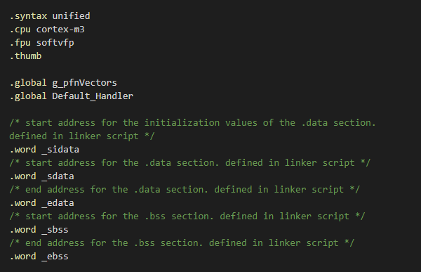

# GNU Assembly Syntax Highlighter

GNU 汇编语法高亮的 VSCode 插件。

这里的汇编主要指嵌入式单片机汇编。

也就是 arm-none-eabi-gcc 生成的汇编文件。

默认识别的文件后缀有 `.asm`，`.s`。

---

## 使用方式

语言模式选择 **GNU Assembly** 即可。

---

## 运行截图

---

## 关于

- [GitHub](https://github.com/demopath/gnu-asm-syntax)
- [MIT License](https://opensource.org/licenses/MIT)

